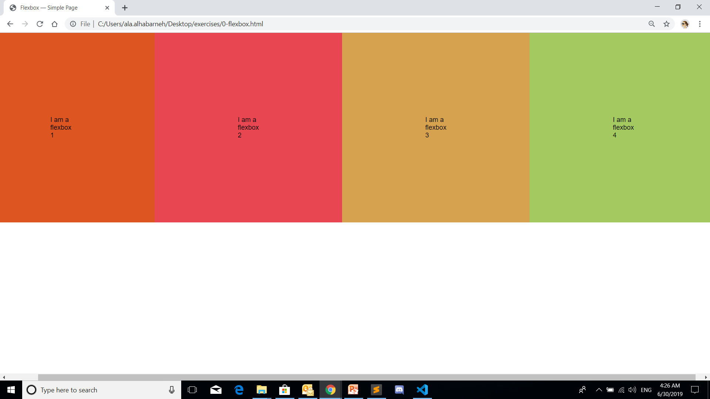
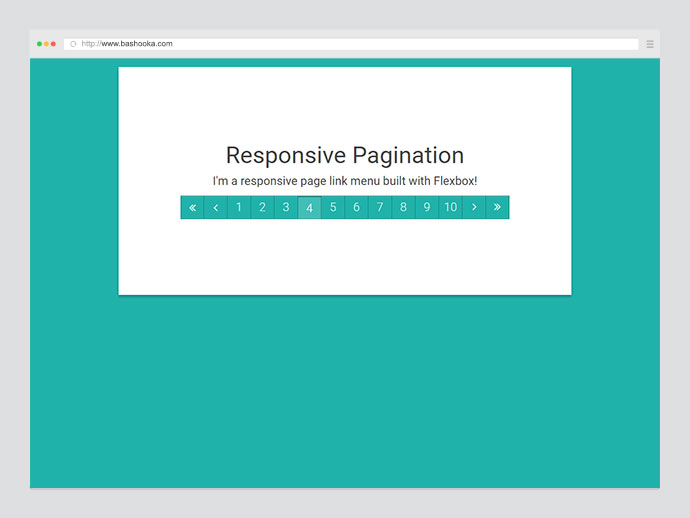
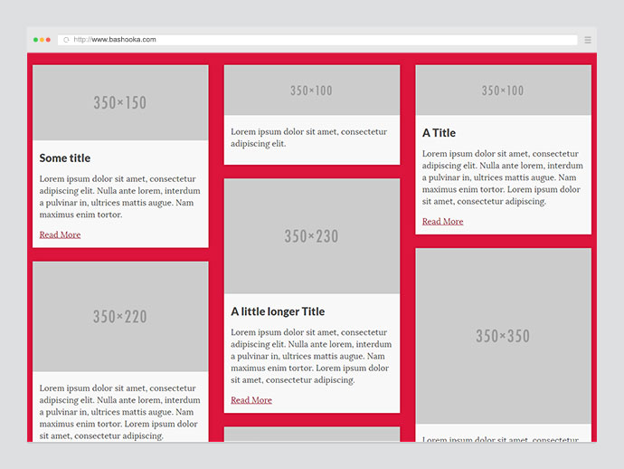
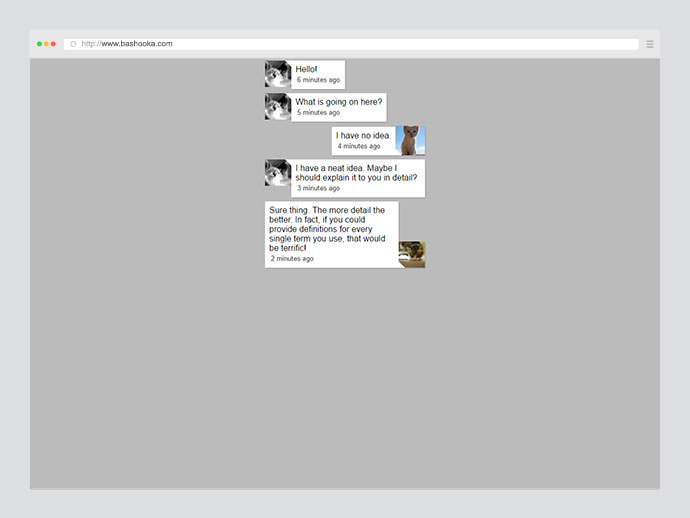
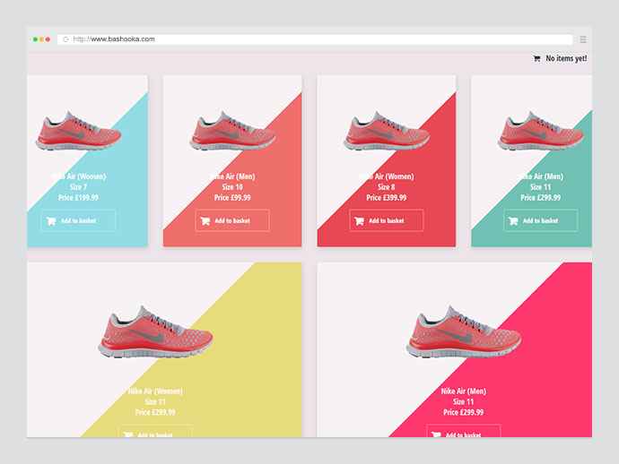
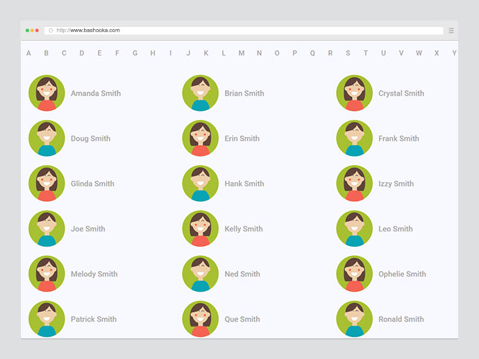

# CSS layout exercises, Part I. (flexbox-layout)

## Exercise #1: Simple flexbox Layout

Make a simple flexbox layout which contain 3 boxes.
Then, implement the requirements below using page-level CSS.

  - All the boxes padding 200px.
  - Each box contain a number.
  - all the boxes should have equal spaces. 

## Exercise #2: Pagniation

Make a pagination  with the following rules:

- The pagination should be up to 10 pages.
- the pagination should contain Next > and previous < buttons.
- you can use buttons to make the pagination or div.
- The pagination page should have a nice look, you are free to choose any style. 

## Exercise #3: Masonry layout

Make a masonry layout which contain a sample articles, each article contain :
  - a thumpnail 350*100 picture, you can use https://placehold.it/ to get as a sample pictures.
  - h2 heading title. 
  - lorem ipsum text.
  - read more link.
  - The article with the `block` class should have different sizes. Further,
    * the thumpnails pictures also have different sizes.
    * the text should be a regular text;
    * you can use any suitable font;

## Exercise #4: Google Hangout Chat Page 

Imitate a simple Google hangout page to display the chating history with the following rules: 
  - You should use only a flex-box layout. 
  - the chating box should contain a chating history.
  - the chating box should contain a thumbnail for the sender and receiver.
  - you are free to choose any style you want. 
  

## Exercise #5: Flexy Product Cards

Make a simple products page to display 10 products with the following rules: 
  - You should use only a flex-box layout. 
  - The products page should contain 10 products not less.
  - Tthe products page should contain a thumbnail for the product, price and product description.
  - You are free to choose any style you want. 
  

## Exercise #6: Alphabet Navigation

Make an alphabet navigation page display 30 students names with the following rules: 
  - You should use only a flex-box layout. 
  - The navigation page should contain up to 30 students names not less.
  - Tthe navigation page should contain a thumbnail for the student and the student name.
  - You are free to choose any style you want. 
  

