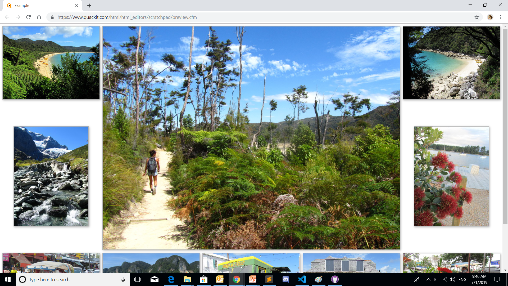
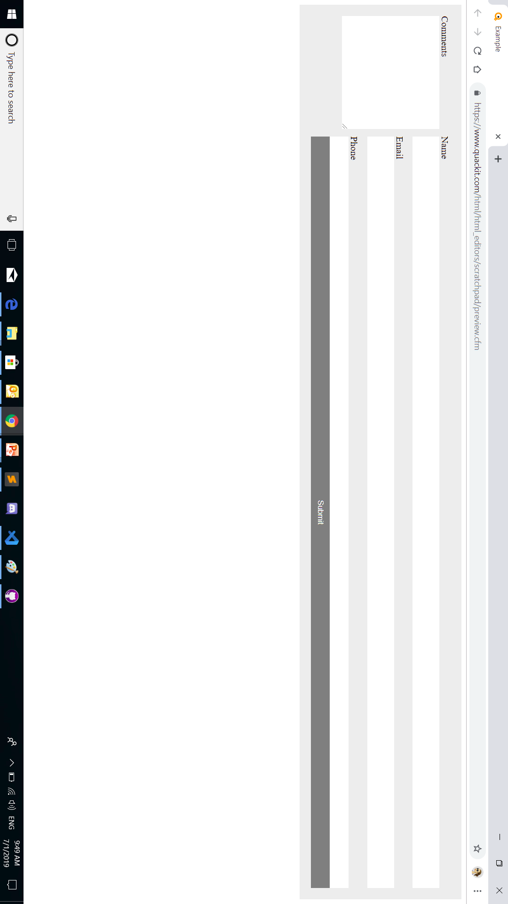
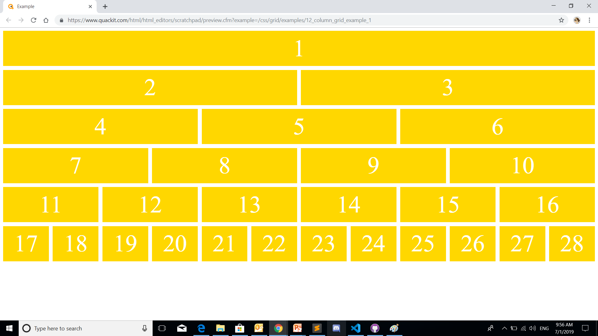
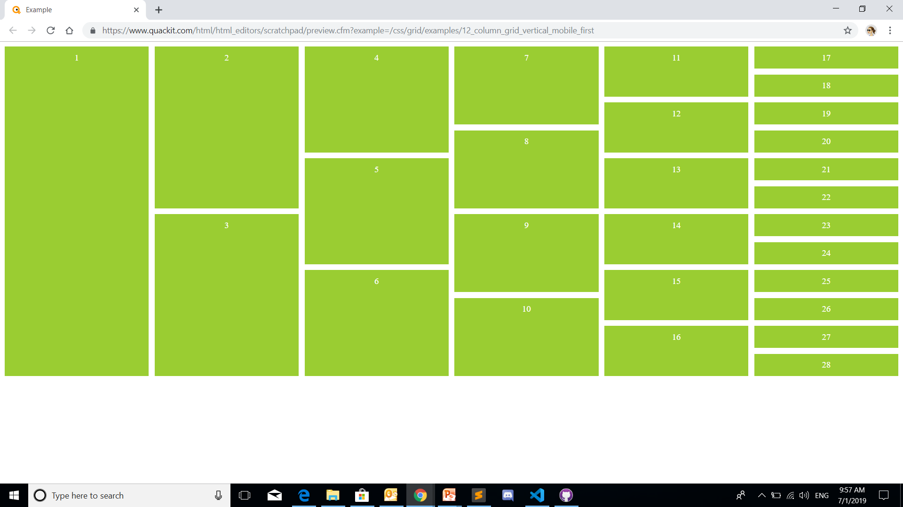
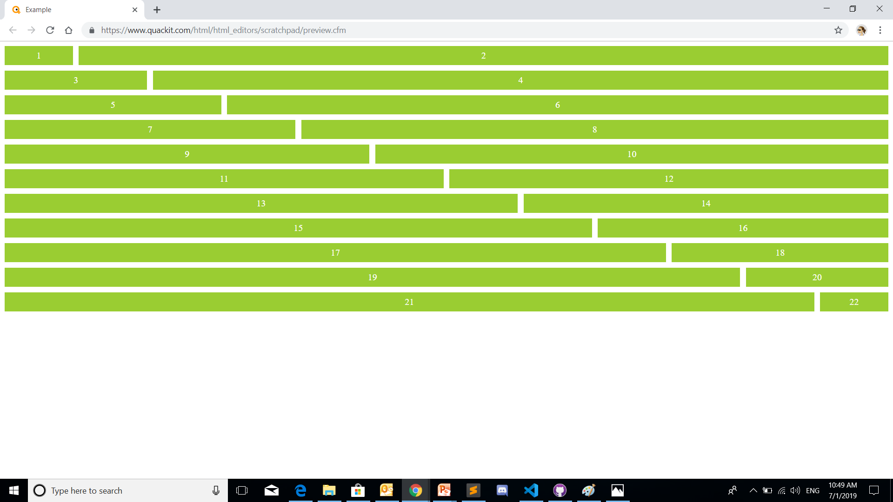

# CSS layout exercises, Part I. (grid-layout)

## Exercise #1: Twitter App

Imagine you want to create a Twitter app, A layout with two columns and two rows.

  - All the boxes should contain box name.
  - all the boxes should have equal spaces.
  - You should use only a grid layout.

## Exercise #2: Photo Gallery 

Make a Photo Gallery to display photos with the following rules:

- The photo gallery should contain at least 10 photos.
- The photo gallery should have a nice look, you are free to choose any style. 
- You should use only a grid layout.

## Exercise #3: Grid Form 

Imitate a simple feedback form page  with the following rules: 
  - You should use only a grid layout. 
  - the form should contain all the elements in the example picture.
  - you are free to choose any style you want. 
  

## Exercise #4: Simple Grid Layout

Make a simple grid layout page, the page should : 
  - contain five plain sections (header, ads, nav, articles, footer).
  - You should use only a grid layout.  
  - You are free to choose any style you want. 
  

## Exercise #5: 12 Column Grids [horizontal ]

Make a simple 12 Column Grids with the following rules: 
  - You should use only a grid layout. 
  - Make a horizontal grid layout.
  - You should stick with the style in the provided picture. 
  

## Exercise #6: 12 Column Grids [vertical]

Make a simple 12 Column Grids with the following rules: 
  - You should use only a grid layout. 
  - Make a vertical grid layout.
  - You should stick with the style in the provided picture. 
  

## Exercise #7: 12 Column Grids [vertical - mobile first ]

Make a simple 12 Column Grids with the following rules: 
  - You should use only a grid layout. 
  - Make a vertical grid layout.
  - You should stick with the style in the provided picture. 
  

